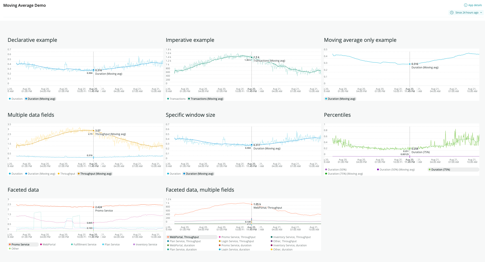

[](https://github.com/newrelic/open-source-office/blob/master/examples/categories/index.md#category-example-code)
# Moving Average Component Demo

## What is It?

This demo nerdpack shows how you can use the `<MovingAverage>` component within your own project.



## Setup

Add the component folder MovingAverage to your own project and import it:
```
import MovingAverage from '../../components/MovingAverage';
```

You can now use the component either declaratively or imperatively. To run the demo make sure you set the account ID to your account ID.

### Declarative example
```
<NrqlQuery
    accountId={1}
    query="SELECT count(*) from Transaction timeseries"
    >
    {({ data }) => {
        return (
            <MovingAverage data={data}>
                {({ adjustedData }) => {
                    return <LineChart data={adjustedData}/>);
                }}
            </MovingAverage>
        );
    }}
</NrqlQuery>
```

### Imperative example
```
<NrqlQuery
    accountId={1}
    query="SELECT count(*) from Transaction timeseries"
    >
    {({ data }) => {
        const processedData = MovingAverage.processData({data: data});
        return (
            <LineChart data={processedData}/>
        );
    }}
</NrqlQuery>
```

## Configurable Options

You can specify the following options either as properties or as attributes of an object:

- **data**: The data in chart data format (the default from `<NrqlQuery>`)
- **window**: Size of moving average window as a % of the total chart time frame. Default: 5% if omitted.
- **buckets**: Size of moving average window in buckets (overrides window if present).
- **suffix**: The suffix to add to the time series label. Can be empty string. Default: "(moving average)"
- **excludeOriginal**: If present and truthy then the original data series are dropped from the data leaving only the moving average data.
